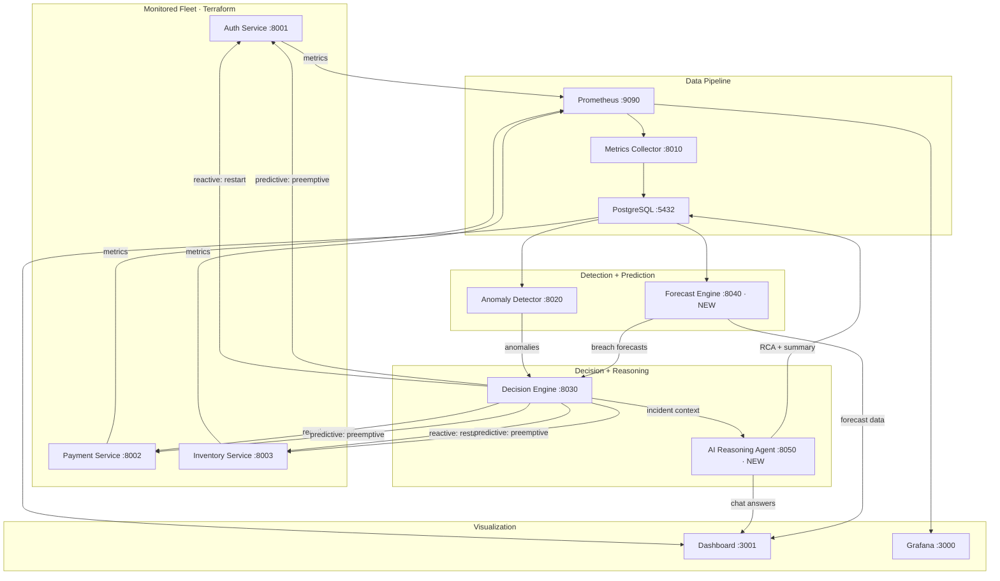

# Phase 7 — Predictive Intelligence & Production Hardening

## Goal

Close two gaps in CloudGuardian AI:
1. **No predictive operations** — add a forecast engine that predicts metric breaches before they happen
2. **No AI reasoning** — add an LLM-powered agent that explains incidents in plain English and answers questions

Plus production hardening: JWT auth, CI/CD, tests, structured logging, real alerting.

---

## Existing Conventions (will match exactly)

| Convention | Pattern |
|---|---|
| Framework | FastAPI + Uvicorn |
| Base image | `python:3.11-slim` |
| Internal port | `8000` (all services) |
| Dockerfile | `COPY requirements.txt → pip install → COPY main.py → EXPOSE 8000 → CMD uvicorn` |
| Health check | `GET /health` → `{"status": "healthy"}` |
| DB connection | `psycopg2.connect(DATABASE_URL)` with `get_connection()` helper |
| DB init | `init_db()` called in a retry loop at startup |
| Background work | `threading.Thread(target=..., daemon=True).start()` |
| CORS | `allow_origins=["*"], allow_methods=["*"], allow_headers=["*"]` |
| Port mapping | External `80X0:8000` (8010, 8020, 8030 → 8040, 8050 next) |
| Network | `cloudguardian-net` (external, created by Terraform) |
| Services list | `["auth-service", "payment-service", "inventory-service"]` |
| Metrics | `cpu_percent`, `memory_mb`, `latency_ms`, `error_rate` |

---

## Architecture After Phase 7



> [!IMPORTANT]
> New data flow: **Forecast Engine** reads from Postgres (same as anomaly-detector), produces breach-risk predictions. **Decision Engine** polls both anomaly-detector AND forecast-engine, logging incidents as `type: reactive` or `type: predictive`. **AI Reasoning Agent** is invoked after each incident to produce a root-cause analysis.

---

## Build Order & Detailed Changes

---

### Step 1: Forecast Engine (new service)

#### [NEW] `services/forecast-engine/main.py`

**Why statsmodels (Holt-Winters) over Prophet**: Prophet requires `cmdstanpy` which needs a C++ compiler and >500MB of dependencies — incompatible with `python:3.11-slim` without a multi-stage build. Holt-Winters from `statsmodels` is lightweight (~30MB), works well for seasonal/trending time-series, and fits the existing slim Docker pattern.

**Design**:
- Background thread reads last 200 data points per service per metric from `metric_readings` table every **5 minutes**, fits Holt-Winters (Exponential Smoothing) model
- Models cached in memory dict `{(service, metric): {"model", "fitted_at", "params"}}`
- Danger thresholds (configurable via env): `cpu_percent > 85`, `memory_mb > 800`, `latency_ms > 400`, `error_rate > 0.15`

**Endpoints**:
- `GET /forecast/{service}/{metric}?minutes=10` → predicted values + confidence interval
- `GET /forecast/breach-risk` → for every metric, whether forecast crosses threshold and ETA
- `GET /health` → `{"status": "healthy"}`
- `GET /metrics` → Prometheus text with `forecast_breach_risk{service=...,metric=...}` gauge

**New Postgres table** (created by forecast-engine's `init_db`):
```sql
CREATE TABLE IF NOT EXISTS forecasts (
    id SERIAL PRIMARY KEY,
    service_name TEXT NOT NULL,
    metric_name TEXT NOT NULL,
    predicted_values JSONB NOT NULL,
    breach_risk DOUBLE PRECISION,
    breach_eta_minutes DOUBLE PRECISION,
    generated_at TIMESTAMPTZ NOT NULL DEFAULT now()
);
```

#### [NEW] `services/forecast-engine/Dockerfile`
Identical pattern to anomaly-detector.

#### [NEW] `services/forecast-engine/requirements.txt`
```
fastapi==0.111.0
uvicorn[standard]==0.30.1
psycopg2-binary==2.9.9
pandas==2.2.2
numpy==1.26.4
statsmodels==0.14.2
prometheus_client==0.20.0
```

#### [NEW] `services/forecast-engine/README.md`
Short doc explaining purpose, endpoints, and model choice.

#### [MODIFY] [docker-compose.yml](file:///d:/CSE%20eng/LY-btech/MINOR%20PROJ-%20CC/cloudguardian-ai/docker-compose.yml)
Add `forecast-engine` service block (port `8040:8000`, depends on postgres + metrics-collector).

#### [MODIFY] [prometheus.yml](file:///d:/CSE%20eng/LY-btech/MINOR%20PROJ-%20CC/cloudguardian-ai/monitoring/prometheus/prometheus.yml)
Add scrape target `forecast-engine:8000`.

#### [MODIFY] [render.yaml](file:///d:/CSE%20eng/LY-btech/MINOR%20PROJ-%20CC/cloudguardian-ai/render.yaml)
Add forecast-engine entry.

---

### Step 2: Wire Forecast into Decision Engine

#### [MODIFY] [decision-engine/main.py](file:///d:/CSE%20eng/LY-btech/MINOR%20PROJ-%20CC/cloudguardian-ai/services/decision-engine/main.py)

1. **Add `incident_type` column** to `incidents` table via idempotent `ALTER TABLE`
2. **New env vars**: `FORECAST_ENGINE_URL`, `FORECAST_BREACH_CONFIDENCE_THRESHOLD`
3. **New function** `check_forecast_breaches()`: polls `GET /forecast/breach-risk`
4. **New function** `trigger_preemptive_action()`: lighter remediation for predicted breaches, logged as `incident_type='predictive'`
5. **Modify `_decision_loop()`**: call forecast check after anomaly check
6. **Update endpoints** to include `incident_type` in responses

#### [MODIFY] [decision-engine/requirements.txt](file:///d:/CSE%20eng/LY-btech/MINOR%20PROJ-%20CC/cloudguardian-ai/services/decision-engine/requirements.txt)
Add `requests==2.32.3`.

---

### Step 3: AI Reasoning Agent (new service)

#### [NEW] `services/ai-reasoning-agent/main.py`

- Uses `anthropic` SDK with `claude-sonnet-4-6`
- **`POST /agent/analyze-incident`**: receives incident context from decision-engine, produces root-cause hypothesis + summary, persists to `incident_reports` table
- **`POST /agent/ask`**: free-text chat using live system state as context
- **`GET /agent/incidents/{id}/report`**: retrieves stored RCA report
- **Graceful degradation**: if API key missing or call fails, returns fallback response — never blocks healing pipeline

**New Postgres table**:
```sql
CREATE TABLE IF NOT EXISTS incident_reports (
    id SERIAL PRIMARY KEY,
    incident_id INTEGER REFERENCES incidents(id),
    root_cause TEXT NOT NULL,
    summary TEXT NOT NULL,
    confidence DOUBLE PRECISION NOT NULL,
    evidence JSONB NOT NULL,
    generated_at TIMESTAMPTZ NOT NULL DEFAULT now()
);
```

#### [NEW] `services/ai-reasoning-agent/{Dockerfile, requirements.txt, README.md}`

#### [MODIFY] [decision-engine/main.py](file:///d:/CSE%20eng/LY-btech/MINOR%20PROJ-%20CC/cloudguardian-ai/services/decision-engine/main.py)
After `trigger_remediation()`, fire-and-forget POST to ai-reasoning-agent with incident context.

#### [MODIFY] [docker-compose.yml](file:///d:/CSE%20eng/LY-btech/MINOR%20PROJ-%20CC/cloudguardian-ai/docker-compose.yml), [prometheus.yml](file:///d:/CSE%20eng/LY-btech/MINOR%20PROJ-%20CC/cloudguardian-ai/monitoring/prometheus/prometheus.yml), [render.yaml](file:///d:/CSE%20eng/LY-btech/MINOR%20PROJ-%20CC/cloudguardian-ai/render.yaml)
Add ai-reasoning-agent entries.

#### [NEW] `.env.example`
```
ANTHROPIC_API_KEY=sk-ant-your-key-here
JWT_SECRET=change-this-to-a-random-string
SLACK_WEBHOOK_URL=https://hooks.slack.com/services/your/webhook/url
```

---

### Step 4: JWT Auth Layer

#### [NEW] `services/shared/auth.py`
- `create_token(subject, role)`, `verify_token(token)`, FastAPI `Depends` middleware
- Service-to-service: shared `SERVICE_TOKEN` env var

#### [MODIFY] All service `main.py` files
- Auth middleware on all non-health/metrics endpoints
- Inter-service calls include `Authorization: Bearer {SERVICE_TOKEN}`

#### Dashboard login
- [NEW] `LoginScreen.jsx` — email/password form
- [MODIFY] `api.js` — JWT storage + header attachment
- Login endpoint on decision-engine: `POST /auth/login`

---

### Step 5: Dashboard Updates

#### [NEW] `services/dashboard/src/components/ForecastPanel.jsx`
- Trend line with shaded confidence band (SVG, matching PulseLine pattern)
- Breach-risk warnings with time-to-breach countdown
- Service/metric selector dropdowns

#### [NEW] `services/dashboard/src/components/AICopilot.jsx`
- Chat UI: input + scrollable message history
- Calls `POST /agent/ask`, renders markdown responses
- Graceful "AI unavailable" fallback

#### [NEW] `services/dashboard/src/components/IncidentDetailModal.jsx`
- Modal triggered by clicking incident in timeline
- Fetches + displays LLM-generated RCA report

#### [MODIFY] [IncidentTimeline.jsx](file:///d:/CSE%20eng/LY-btech/MINOR%20PROJ-%20CC/cloudguardian-ai/services/dashboard/src/components/IncidentTimeline.jsx)
- Add predictive vs reactive badge (🔮 blue vs ⚡ amber)
- Make rows clickable → opens modal

#### [MODIFY] [App.jsx](file:///d:/CSE%20eng/LY-btech/MINOR%20PROJ-%20CC/cloudguardian-ai/services/dashboard/src/App.jsx), [App.css](file:///d:/CSE%20eng/LY-btech/MINOR%20PROJ-%20CC/cloudguardian-ai/services/dashboard/src/App.css), [api.js](file:///d:/CSE%20eng/LY-btech/MINOR%20PROJ-%20CC/cloudguardian-ai/services/dashboard/src/api.js)
- Import new components, add forecast/AI endpoints, JWT handling, login gate

#### [MODIFY] [package.json](file:///d:/CSE%20eng/LY-btech/MINOR%20PROJ-%20CC/cloudguardian-ai/services/dashboard/package.json)
- Add `react-markdown` dependency

---

### Step 6: Tests + CI

#### New test files
| File | Tests |
|---|---|
| `services/forecast-engine/tests/test_forecast.py` | Holt-Winters training, breach-risk calc, endpoint shapes |
| `services/anomaly-detector/tests/test_anomaly.py` | Z-score flagging, IsolationForest threshold, DB insert |
| `services/decision-engine/tests/test_decision.py` | Cooldown logic, trigger threshold, reactive vs predictive, verification |
| `services/ai-reasoning-agent/tests/test_agent.py` | Graceful degradation, report persistence, chat endpoint |
| `services/metrics-collector/tests/test_collector.py` | PromQL parsing, gap detection, DB write |
| `tests/test_integration.py` | Full pipeline: chaos → detect → decide → heal → resolve |

#### [NEW] `.github/workflows/ci.yml`
Jobs: `lint` (ruff), `test` (pytest), `build` (docker build all services), `terraform-validate` (all 3 configs)

---

### Step 7: Structured Logging + Alerting

#### All Python services
- Replace `print()` with JSON-formatted logging via `python-json-logger`
- Fields: `service`, `correlation_id`, `severity`, `timestamp`
- Decision engine generates `correlation_id` (UUID) per incident, passed to AI agent

#### [MODIFY] [decision-engine/main.py](file:///d:/CSE%20eng/LY-btech/MINOR%20PROJ-%20CC/cloudguardian-ai/services/decision-engine/main.py)
- After incident creation: publish to LocalStack SNS (`cloudguardian-alerts` topic) via `boto3`
- If `SLACK_WEBHOOK_URL` set: POST formatted alert to Slack webhook
- Both wrapped in try/except — alerting never blocks healing

#### [MODIFY] [decision-engine/requirements.txt](file:///d:/CSE%20eng/LY-btech/MINOR%20PROJ-%20CC/cloudguardian-ai/services/decision-engine/requirements.txt)
Add `boto3==1.34.0`, `python-json-logger==2.0.7`.

#### [MODIFY] [terraform/aws-simulated/main.tf](file:///d:/CSE%20eng/LY-btech/MINOR%20PROJ-%20CC/cloudguardian-ai/terraform/aws-simulated/main.tf)
Add `aws_sns_topic` resource for `cloudguardian-alerts`.

---

### Step 8: Tier 3 Stretch Items

> [!NOTE]
> **Tier 3 status** — documented but not implemented:
> - **Kubernetes manifests / Helm chart**: Not implemented. Next step: translate docker-compose → K8s Deployments, add kubectl-based remediation executor.
> - **Cost-governance panel**: Not implemented. Could show estimated $ saved per healing action with mock pricing.
> - **Chaos calendar**: Not implemented. Could be a cron-based service reading schedules from Postgres.

---

## Files Summary

| Category | New | Modified |
|---|---|---|
| Forecast Engine | 4 files (`main.py, Dockerfile, requirements.txt, README.md`) | — |
| AI Reasoning Agent | 4 files | — |
| Decision Engine | — | `main.py, requirements.txt` |
| Auth | `services/shared/auth.py` | All service `main.py` files |
| Dashboard | 4 new components | `App.jsx, App.css, api.js, IncidentTimeline.jsx, package.json` |
| Tests | 6 test files | — |
| CI/CD | `.github/workflows/ci.yml` | — |
| Config | `.env.example` | `docker-compose.yml, render.yaml, prometheus.yml, .gitignore` |
| Terraform | — | `aws-simulated/main.tf` |

---

## Open Questions

> [!IMPORTANT]
> **Anthropic API key**: The AI reasoning agent needs an API key from [console.anthropic.com](https://console.anthropic.com). It degrades gracefully without one (returns stub responses). Do you already have a key, or should I focus on a fully functional stub mode?

> [!IMPORTANT]
> **Dashboard theme**: The Phase 7 brief says "styled consistently with the existing dark/glassmorphism theme." This conflicts with our earlier redesign discussion. I'll **keep the existing dark theme** for Phase 7. We can revisit the light theme separately afterward. OK?

> [!NOTE]
> **Slack webhook**: Optional for alerting. If you have a Slack workspace, you can set up an incoming webhook. Otherwise alerting works via LocalStack SNS (visible in docker logs). Include Slack integration or skip?

---

## Verification Plan

After each step:
```powershell
cd terraform/local-infra && terraform apply -auto-approve && cd ../..
docker compose up --build
curl.exe -X POST "http://localhost:8002/chaos/cpu_spike?duration_seconds=90"
curl.exe http://localhost:8040/health          # forecast-engine
curl.exe http://localhost:8050/health          # ai-reasoning-agent
curl.exe http://localhost:8040/forecast/breach-risk
curl.exe http://localhost:8030/incidents/current?minutes=10
pytest services/ -v
```
