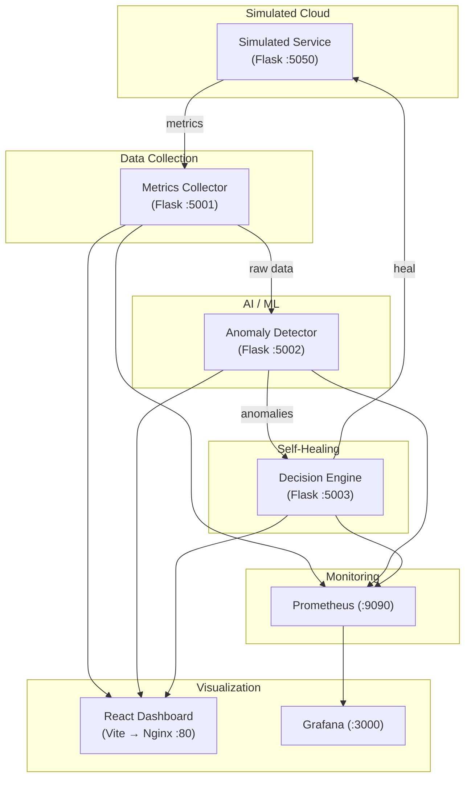
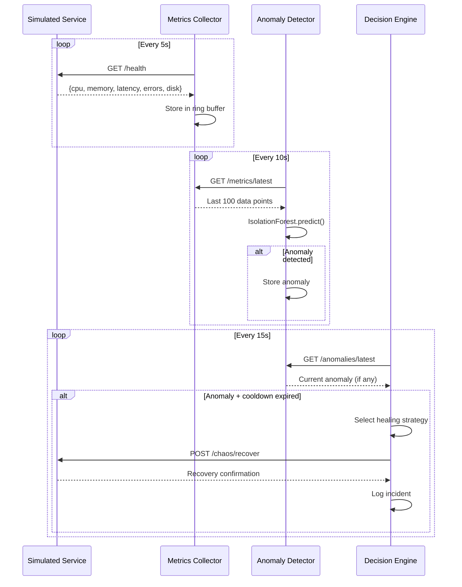

# CloudGuardian AI — Full Project Walkthrough

## Overview

**CloudGuardian AI** is an AI-powered, self-healing cloud infrastructure platform. It automatically monitors cloud services, detects anomalies using machine learning (Isolation Forest), makes remediation decisions, and executes healing actions — all in real-time. It's built as a **microservices architecture** with Docker, Prometheus, Grafana, Terraform, and a React dashboard.

---

## Project Tree

```
cloudguardian-ai/
├── .gitignore
├── README.md
├── docker-compose.yml
├── render.yaml
├── scripts/
│   └── evaluate_detector.py
├── services/
│   ├── anomaly-detector/
│   │   ├── Dockerfile
│   │   ├── main.py
│   │   └── requirements.txt
│   ├── dashboard/
│   │   ├── .dockerignore
│   │   ├── Dockerfile
│   │   ├── index.html
│   │   ├── nginx.conf
│   │   ├── package.json
│   │   ├── vite.config.js
│   │   └── src/
│   │       ├── main.jsx
│   │       ├── App.jsx
│   │       ├── App.css
│   │       ├── api.js
│   │       ├── styles.css
│   │       └── components/
│   │           ├── AnomalyFeed.jsx
│   │           ├── ChaosControlPanel.jsx
│   │           ├── IncidentTimeline.jsx
│   │           ├── PulseLine.jsx
│   │           ├── ServiceVitalCard.jsx
│   │           └── TopBar.jsx
│   ├── decision-engine/
│   │   ├── Dockerfile
│   │   ├── main.py
│   │   └── requirements.txt
│   ├── metrics-collector/
│   │   ├── Dockerfile
│   │   ├── main.py
│   │   └── requirements.txt
│   └── simulated-service/
│       ├── Dockerfile
│       ├── main.py
│       └── requirements.txt
├── monitoring/
│   ├── grafana/
│   │   └── provisioning/
│   │       ├── dashboards/dashboards.yml
│   │       └── datasources/datasource.yml
│   └── prometheus/
│       └── prometheus.yml
└── terraform/
    ├── aws-simulated/
    │   ├── main.tf
    │   ├── variables.tf
    │   └── outputs.tf
    ├── gcp-real/
    │   ├── main.tf
    │   ├── variables.tf
    │   ├── outputs.tf
    │   └── startup-script.sh.tpl
    └── local-infra/
        ├── main.tf
        ├── variables.tf
        └── outputs.tf
```

---

## Architecture



> [!IMPORTANT]
> The data flows in a closed loop: **Simulated Service → Metrics Collector → Anomaly Detector → Decision Engine → Simulated Service (heal)**. This is the self-healing feedback loop.

---

## Service-by-Service Breakdown

---

### 1. Simulated Service (`services/simulated-service/`)

**Purpose**: Simulates a real cloud service with controllable failure modes (chaos engineering).

| File | Description |
|------|-------------|
| [main.py](file:///d:/CSE%20eng/LY-btech/MINOR%20PROJ-%20CC/cloudguardian-ai/services/simulated-service/main.py) | Flask app on port `5050` |
| [Dockerfile](file:///d:/CSE%20eng/LY-btech/MINOR%20PROJ-%20CC/cloudguardian-ai/services/simulated-service/Dockerfile) | Python 3.11-slim container |
| [requirements.txt](file:///d:/CSE%20eng/LY-btech/MINOR%20PROJ-%20CC/cloudguardian-ai/services/simulated-service/requirements.txt) | `flask`, `prometheus_client` |

**Key Features**:
- **Chaos injection endpoints**: `POST /chaos/inject` to trigger failures like `cpu_spike`, `memory_leak`, `latency_spike`, `error_rate`, `disk_full`
- **Auto-recovery endpoint**: `POST /chaos/recover` to restore normal operation
- **Health endpoint**: `GET /health` returns current status and active chaos conditions
- **Metrics endpoint**: `GET /metrics` exposes Prometheus-compatible gauges (`sim_cpu_usage`, `sim_memory_usage`, `sim_request_latency`, `sim_error_rate`, `sim_disk_usage`)
- Background thread generates realistic metric variations using random noise

---

### 2. Metrics Collector (`services/metrics-collector/`)

**Purpose**: Polls the simulated service and collects/stores metrics with timestamps.

| File | Description |
|------|-------------|
| [main.py](file:///d:/CSE%20eng/LY-btech/MINOR%20PROJ-%20CC/cloudguardian-ai/services/metrics-collector/main.py) | Flask app on port `5001` |
| [Dockerfile](file:///d:/CSE%20eng/LY-btech/MINOR%20PROJ-%20CC/cloudguardian-ai/services/metrics-collector/Dockerfile) | Python 3.11-slim container |
| [requirements.txt](file:///d:/CSE%20eng/LY-btech/MINOR%20PROJ-%20CC/cloudguardian-ai/services/metrics-collector/requirements.txt) | `flask`, `requests`, `prometheus_client` |

**Key Features**:
- Background thread polls `http://simulated-service:5050/health` every **5 seconds**
- Stores up to **1000** data points in a ring buffer
- Exposes `GET /metrics/latest` (last 100 points) and `GET /metrics/summary` (mean, max, min, std for each metric)
- Exposes Prometheus gauges: `collector_cpu_usage`, `collector_memory_usage`, etc.
- `GET /health` returns collector status with collection count

---

### 3. Anomaly Detector (`services/anomaly-detector/`)

**Purpose**: Uses an **Isolation Forest** ML model to detect anomalies in real-time metrics.

| File | Description |
|------|-------------|
| [main.py](file:///d:/CSE%20eng/LY-btech/MINOR%20PROJ-%20CC/cloudguardian-ai/services/anomaly-detector/main.py) | Flask app on port `5002` |
| [Dockerfile](file:///d:/CSE%20eng/LY-btech/MINOR%20PROJ-%20CC/cloudguardian-ai/services/anomaly-detector/Dockerfile) | Python 3.11-slim container |
| [requirements.txt](file:///d:/CSE%20eng/LY-btech/MINOR%20PROJ-%20CC/cloudguardian-ai/services/anomaly-detector/requirements.txt) | `flask`, `numpy`, `scikit-learn`, `requests`, `prometheus_client` |

**Key Features**:
- **Training**: Background thread continuously fetches data from the metrics collector. Once **50+ samples** are gathered, it trains an `IsolationForest` model (`contamination=0.1`, `n_estimators=100`, `random_state=42`)
- **Detection**: Background thread runs every **10 seconds**, scoring the latest metrics. If the model predicts anomaly (`-1`) AND the anomaly score < `-0.5`, it's flagged
- **Rule-based fallback**: Even without a trained model, threshold rules flag CPU > 80%, memory > 85%, latency > 500ms, error rate > 10%, disk > 90%
- **Anomaly history**: Stores up to **100** detected anomalies
- **Endpoints**: `GET /anomalies/latest`, `GET /anomalies/history`, `GET /health`, `GET /metrics` (Prometheus)

---

### 4. Decision Engine (`services/decision-engine/`)

**Purpose**: Consumes anomaly data and decides on remediation actions, then executes self-healing.

| File | Description |
|------|-------------|
| [main.py](file:///d:/CSE%20eng/LY-btech/MINOR%20PROJ-%20CC/cloudguardian-ai/services/decision-engine/main.py) | Flask app on port `5003` |
| [Dockerfile](file:///d:/CSE%20eng/LY-btech/MINOR%20PROJ-%20CC/cloudguardian-ai/services/decision-engine/Dockerfile) | Python 3.11-slim container |
| [requirements.txt](file:///d:/CSE%20eng/LY-btech/MINOR%20PROJ-%20CC/cloudguardian-ai/services/decision-engine/requirements.txt) | `flask`, `requests`, `prometheus_client` |

**Key Features**:
- Background thread polls `http://anomaly-detector:5002/anomalies/latest` every **15 seconds**
- **Healing strategies** map metric types to actions:
  - `cpu_usage` → scale horizontally (add instances)
  - `memory_usage` → restart service
  - `request_latency` → enable caching / optimize
  - `error_rate` → rollback to last stable version
  - `disk_usage` → clean temporary files
- **Cooldown**: 60-second cooldown between heal actions for the same metric type
- **Automatic recovery**: Calls `POST http://simulated-service:5050/chaos/recover` to execute the heal
- **Incident timeline**: Stores up to **200** incident records (detection → decision → healing action → result)
- **Endpoints**: `GET /decisions/latest`, `GET /incidents`, `GET /health`, `GET /metrics`

---

### 5. Dashboard (`services/dashboard/`)

**Purpose**: A real-time React dashboard for visualizing the entire self-healing pipeline.

| File | Description |
|------|-------------|
| [App.jsx](file:///d:/CSE%20eng/LY-btech/MINOR%20PROJ-%20CC/cloudguardian-ai/services/dashboard/src/App.jsx) | Main React app — fetches from all APIs every 3s |
| [api.js](file:///d:/CSE%20eng/LY-btech/MINOR%20PROJ-%20CC/cloudguardian-ai/services/dashboard/src/api.js) | API client with `BASE_URL` for all backend services |
| [App.css](file:///d:/CSE%20eng/LY-btech/MINOR%20PROJ-%20CC/cloudguardian-ai/services/dashboard/src/App.css) | Dark-themed CSS with glassmorphism effects |
| [styles.css](file:///d:/CSE%20eng/LY-btech/MINOR%20PROJ-%20CC/cloudguardian-ai/services/dashboard/src/styles.css) | Additional component-level styles |
| [main.jsx](file:///d:/CSE%20eng/LY-btech/MINOR%20PROJ-%20CC/cloudguardian-ai/services/dashboard/src/main.jsx) | React entry point |
| [index.html](file:///d:/CSE%20eng/LY-btech/MINOR%20PROJ-%20CC/cloudguardian-ai/services/dashboard/index.html) | HTML shell with Google Fonts (Inter) |
| [vite.config.js](file:///d:/CSE%20eng/LY-btech/MINOR%20PROJ-%20CC/cloudguardian-ai/services/dashboard/vite.config.js) | Vite config with API proxy to port 5001 |
| [package.json](file:///d:/CSE%20eng/LY-btech/MINOR%20PROJ-%20CC/cloudguardian-ai/services/dashboard/package.json) | React 19, Vite 6, Recharts for charts |
| [Dockerfile](file:///d:/CSE%20eng/LY-btech/MINOR%20PROJ-%20CC/cloudguardian-ai/services/dashboard/Dockerfile) | Multi-stage build: Node → Nginx |
| [nginx.conf](file:///d:/CSE%20eng/LY-btech/MINOR%20PROJ-%20CC/cloudguardian-ai/services/dashboard/nginx.conf) | Nginx config serving static files on port 80 |

#### Dashboard Components

| Component | Description |
|-----------|-------------|
| [TopBar.jsx](file:///d:/CSE%20eng/LY-btech/MINOR%20PROJ-%20CC/cloudguardian-ai/services/dashboard/src/components/TopBar.jsx) | Header with title, shield icon, and live status indicator (pulsing green/red dot) |
| [ServiceVitalCard.jsx](file:///d:/CSE%20eng/LY-btech/MINOR%20PROJ-%20CC/cloudguardian-ai/services/dashboard/src/components/ServiceVitalCard.jsx) | Metric cards showing CPU, Memory, Latency, Error Rate, Disk with color-coded severity |
| [PulseLine.jsx](file:///d:/CSE%20eng/LY-btech/MINOR%20PROJ-%20CC/cloudguardian-ai/services/dashboard/src/components/PulseLine.jsx) | Real-time line chart using Recharts (`LineChart` with area gradient) showing last 30 data points |
| [AnomalyFeed.jsx](file:///d:/CSE%20eng/LY-btech/MINOR%20PROJ-%20CC/cloudguardian-ai/services/dashboard/src/components/AnomalyFeed.jsx) | Live anomaly alert feed with severity badges and timestamps |
| [ChaosControlPanel.jsx](file:///d:/CSE%20eng/LY-btech/MINOR%20PROJ-%20CC/cloudguardian-ai/services/dashboard/src/components/ChaosControlPanel.jsx) | Buttons to inject chaos (CPU Spike, Memory Leak, Latency, Errors, Disk Full) and trigger recovery |
| [IncidentTimeline.jsx](file:///d:/CSE%20eng/LY-btech/MINOR%20PROJ-%20CC/cloudguardian-ai/services/dashboard/src/components/IncidentTimeline.jsx) | Scrollable incident timeline showing detection → decision → healing action → outcome |

---

## Infrastructure & Monitoring

---

### Docker Compose ([docker-compose.yml](file:///d:/CSE%20eng/LY-btech/MINOR%20PROJ-%20CC/cloudguardian-ai/docker-compose.yml))

Orchestrates **7 containers** on a shared `cloudguardian` bridge network:

| Service | Port | Build Context |
|---------|------|---------------|
| `simulated-service` | 5050 | `./services/simulated-service` |
| `metrics-collector` | 5001 | `./services/metrics-collector` |
| `anomaly-detector` | 5002 | `./services/anomaly-detector` |
| `decision-engine` | 5003 | `./services/decision-engine` |
| `dashboard` | 3001 | `./services/dashboard` |
| `prometheus` | 9090 | (image: `prom/prometheus`) |
| `grafana` | 3000 | (image: `grafana/grafana`) |

Dependencies are set so services start in order: `simulated-service` → `metrics-collector` → `anomaly-detector` → `decision-engine`.

### Prometheus ([prometheus.yml](file:///d:/CSE%20eng/LY-btech/MINOR%20PROJ-%20CC/cloudguardian-ai/monitoring/prometheus/prometheus.yml))

- Scrape interval: **15 seconds**
- Targets: `metrics-collector:5001`, `anomaly-detector:5002`, `decision-engine:5003`, `simulated-service:5050`
- Path: `/metrics` on all targets

### Grafana

- [datasource.yml](file:///d:/CSE%20eng/LY-btech/MINOR%20PROJ-%20CC/cloudguardian-ai/monitoring/grafana/provisioning/datasources/datasource.yml): Auto-provisions Prometheus as the default data source (`http://prometheus:9090`)
- [dashboards.yml](file:///d:/CSE%20eng/LY-btech/MINOR%20PROJ-%20CC/cloudguardian-ai/monitoring/grafana/provisioning/dashboards/dashboards.yml): Auto-provisions dashboards from `/var/lib/grafana/dashboards`

---

## Terraform Configurations

---

### 1. AWS Simulated ([terraform/aws-simulated/](file:///d:/CSE%20eng/LY-btech/MINOR%20PROJ-%20CC/cloudguardian-ai/terraform/aws-simulated))

Uses `localstack/localstack` provider to simulate AWS locally:
- Creates an **S3 bucket** (`cloudguardian-metrics-store`) for metrics archival
- Creates a **DynamoDB table** (`cloudguardian-incidents`) for incident logs (partition key: `incident_id`, sort key: `timestamp`)
- Creates an **SNS topic** (`cloudguardian-alerts`) for alert notifications
- Outputs: bucket name, table name, SNS topic ARN

### 2. GCP Real ([terraform/gcp-real/](file:///d:/CSE%20eng/LY-btech/MINOR%20PROJ-%20CC/cloudguardian-ai/terraform/gcp-real))

For **real GCP deployment**:
- Creates a **GCE instance** (`e2-medium`, Debian 11) with Docker pre-installed via a startup script template
- Configures a **firewall rule** allowing ports 3000, 3001, 5001-5003, 5050, 9090
- Startup script clones the repo, runs `docker-compose up -d`
- Outputs: instance IP, SSH command, dashboard URL

### 3. Local Infra ([terraform/local-infra/](file:///d:/CSE%20eng/LY-btech/MINOR%20PROJ-%20CC/cloudguardian-ai/terraform/local-infra))

Uses the **Docker Terraform provider** to manage containers locally:
- Creates a `cloudguardian` Docker network
- Builds and runs 4 service containers (simulated-service, metrics-collector, anomaly-detector, decision-engine) from local images
- Maps ports matching docker-compose

---

## Deployment Config

### Render ([render.yaml](file:///d:/CSE%20eng/LY-btech/MINOR%20PROJ-%20CC/cloudguardian-ai/render.yaml))

Defines 5 Render web services (all `free` plan, Docker runtime):
- `cloudguardian-simulated-service` (port 5050)
- `cloudguardian-metrics-collector` (port 5001) — depends on `SIMULATED_SERVICE_URL`
- `cloudguardian-anomaly-detector` (port 5002) — depends on `METRICS_COLLECTOR_URL`
- `cloudguardian-decision-engine` (port 5003) — depends on `ANOMALY_DETECTOR_URL` and `SIMULATED_SERVICE_URL`
- `cloudguardian-dashboard` (port 80)

---

## Evaluation Script

### [evaluate_detector.py](file:///d:/CSE%20eng/LY-btech/MINOR%20PROJ-%20CC/cloudguardian-ai/scripts/evaluate_detector.py)

A standalone evaluation script that:
1. **Generates synthetic data**: 1000 normal samples + 100 anomalous samples across 5 metrics
2. **Trains an IsolationForest** model with same parameters as the detector service
3. **Evaluates**: Calculates accuracy, precision, recall, F1 score, and confusion matrix
4. **Prints a detailed report** with per-metric analysis and recommendations

---

## Key Technical Decisions

| Decision | Rationale |
|----------|-----------|
| **Isolation Forest** (unsupervised) | Doesn't require labeled anomaly data; learns normal patterns and flags deviations |
| **Rule-based fallback** | Ensures anomaly detection works even before ML model is trained (cold start) |
| **60s cooldown** in decision engine | Prevents cascading heal actions from overwhelming the system |
| **Microservices architecture** | Each concern (collection, detection, decision, simulation) is independently scalable and deployable |
| **Prometheus + Grafana** | Industry-standard observability stack for real-time metrics and dashboards |
| **React + Vite + Recharts** | Fast dev experience, lightweight charting, modern frontend |
| **LocalStack for AWS** | Enables full AWS simulation locally without cloud costs |
| **Multi-stage Docker builds** | Keeps production images small (node build → nginx serve) |

---

## Data Flow Summary



---

## Potential Improvements

> [!TIP]
> Areas that could be enhanced:
> - **Persistence**: Currently all data is in-memory (ring buffers). Adding Redis/PostgreSQL would survive restarts.
> - **Authentication**: No auth on any endpoints. Adding JWT/API keys for production use.
> - **Multi-model detection**: Could add LSTM or Autoencoders alongside Isolation Forest for ensemble detection.
> - **Alert notifications**: SNS topic is provisioned in Terraform but not wired to the decision engine.
> - **CI/CD**: No GitHub Actions or pipeline configs yet.
> - **Tests**: No unit/integration tests beyond the evaluation script.
