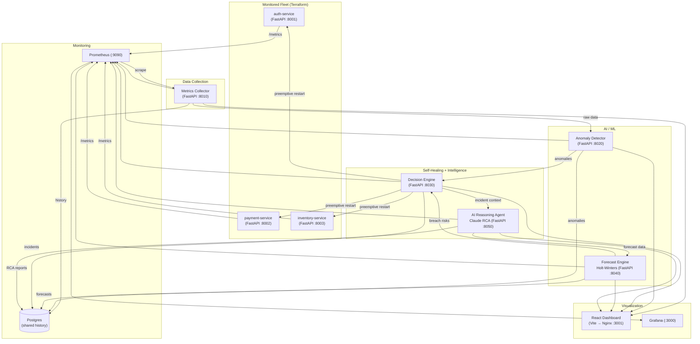
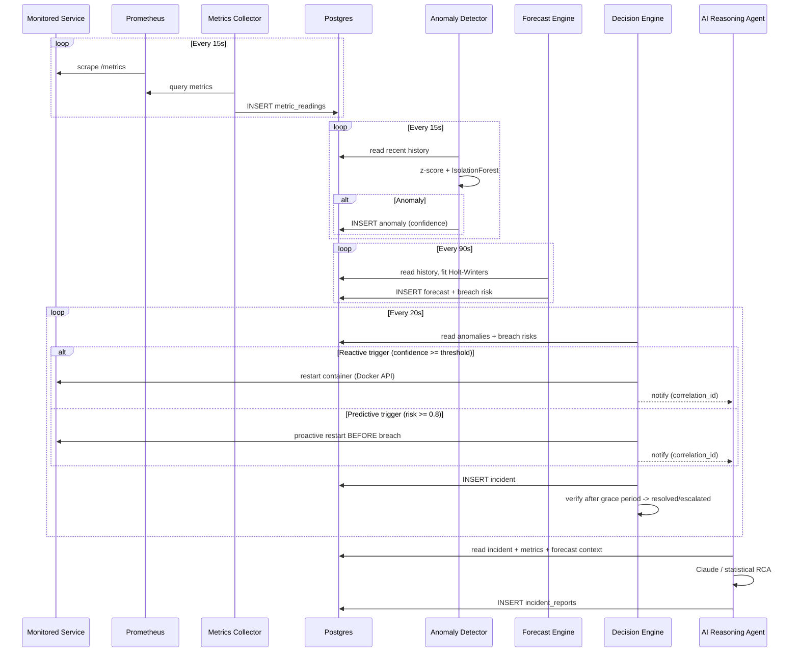

# CloudGuardian AI — Full Project Walkthrough

## Overview

**CloudGuardian AI** is an AI-powered, self-healing cloud infrastructure platform. It automatically monitors cloud services, detects anomalies using machine learning (Isolation Forest + rolling z-score), **forecasts SLO breaches before they happen** (Holt-Winters), makes remediation decisions, and executes healing actions — then verifies them. Every incident is turned into an **AI root-cause report**. It's built as a **microservices architecture** with Docker, Prometheus, Grafana, Postgres, Terraform, GitHub Actions CI, and a React dashboard.

---

## Project Tree

```
cloudguardian-ai/
├── .gitignore
├── .ruff.toml
├── .github/workflows/ci.yml        # Phase 7: ruff + pytest + dashboard build + terraform validate
├── README.md
├── conftest.py                     # Phase 7: shared pytest fixtures (in-memory Postgres mocks)
├── docker-compose.yml
├── render.yaml
├── docs/                           # phase brief, build plan, this walkthrough
├── scripts/
│   └── evaluate_detector.py
├── tests/
│   └── test_integration.py         # Phase 7: detect -> act -> verify integration test
├── services/
│   ├── shared/
│   │   ├── auth.py                 # Phase 7: JWT source of truth (copied into each service)
│   │   └── logutil.py              # Phase 7: JSON logger source of truth
│   ├── simulated-service/
│   │   ├── Dockerfile
│   │   ├── main.py                 # FastAPI + chaos endpoints + Prometheus metrics
│   │   └── requirements.txt
│   ├── metrics-collector/          # port 8010
│   │   ├── main.py
│   │   ├── auth.py
│   │   ├── logutil.py
│   │   ├── tests/test_collector.py
│   │   ├── Dockerfile
│   │   └── requirements.txt
│   ├── anomaly-detector/           # port 8020
│   │   ├── main.py
│   │   ├── auth.py
│   │   ├── logutil.py
│   │   ├── tests/test_anomaly.py
│   │   ├── Dockerfile
│   │   └── requirements.txt
│   ├── decision-engine/            # port 8030
│   │   ├── main.py
│   │   ├── auth.py
│   │   ├── logutil.py
│   │   ├── tests/test_decision.py
│   │   ├── Dockerfile
│   │   └── requirements.txt
│   ├── forecast-engine/            # port 8040 (Phase 7)
│   │   ├── main.py
│   │   ├── auth.py
│   │   ├── logutil.py
│   │   ├── tests/test_forecast.py
│   │   ├── Dockerfile
│   │   └── requirements.txt
│   ├── ai-reasoning-agent/         # port 8050 (Phase 7)
│   │   ├── main.py
│   │   ├── auth.py
│   │   ├── logutil.py
│   │   ├── tests/test_agent.py
│   │   ├── Dockerfile
│   │   └── requirements.txt
│   └── dashboard/
│       ├── Dockerfile
│       ├── index.html
│       ├── nginx.conf
│       ├── package.json
│       ├── vite.config.js
│       └── src/
│           ├── main.jsx
│           ├── App.jsx
│           ├── App.css
│           ├── api.js
│           ├── styles.css
│           └── components/
│               ├── LoginScreen.jsx          # Phase 7
│               ├── AnomalyFeed.jsx
│               ├── ChaosControlPanel.jsx
│               ├── IncidentTimeline.jsx
│               ├── IncidentDetailModal.jsx  # Phase 7
│               ├── ForecastPanel.jsx        # Phase 7
│               ├── AICopilot.jsx            # Phase 7
│               ├── PulseLine.jsx
│               ├── ServiceVitalCard.jsx
│               └── TopBar.jsx
├── monitoring/
│   ├── grafana/
│   │   └── provisioning/
│   │       ├── dashboards/dashboards.yml
│   │       └── datasources/datasource.yml
│   └── prometheus/
│       └── prometheus.yml
└── terraform/
    ├── aws-simulated/
    │   ├── main.tf                  # S3 bucket via AWS provider -> LocalStack
    │   ├── variables.tf
    │   └── outputs.tf
    ├── gcp-real/
    │   ├── main.tf                  # real GCE instance blueprint
    │   ├── variables.tf
    │   ├── outputs.tf
    │   └── startup-script.sh.tpl
    └── local-infra/
        ├── main.tf                  # creates cloudguardian-net + 3 monitored services
        ├── variables.tf
        └── outputs.tf
```

---

## Architecture



> [!IMPORTANT]
> Two closed loops exist now: the **reactive** loop
> **Service → Metrics Collector → Anomaly Detector → Decision Engine → Service (heal → verify)**
> and the **predictive** loop
> **Forecast Engine → Decision Engine → Service (act before the SLO is breached)**.
> The AI Reasoning Agent sits on the side, turning every incident into a
> root-cause report for the dashboard.

---

## Service-by-Service Breakdown

---

### 1. Simulated Service (`services/simulated-service/`)

**Purpose**: Simulates a real cloud service with controllable failure modes (chaos engineering). Terraform provisions three instances — `auth-service`, `payment-service`, `inventory-service` — that share this image.

| File | Description |
|------|-------------|
| [main.py](file:///d:/CSE%20eng/LY-btech/MINOR%20PROJ-%20CC/cloudguardian-ai/services/simulated-service/main.py) | FastAPI app, container port `8000` |
| [Dockerfile](file:///d:/CSE%20eng/LY-btech/MINOR%20PROJ-%20CC/cloudguardian-ai/services/simulated-service/Dockerfile) | Python 3.11-slim container |
| [requirements.txt](file:///d:/CSE%20eng/LY-btech/MINOR%20PROJ-%20CC/cloudguardian-ai/services/simulated-service/requirements.txt) | `fastapi`, `uvicorn`, `prometheus_client` |

**Key Features**:
- **Chaos injection endpoints**: `POST /chaos/{cpu_spike|memory_leak|latency_spike|error_storm}?duration_seconds=N` to trigger failures; `POST /chaos/stop` to recover early
- **Health endpoint**: `GET /health` returns current status and active chaos conditions
- **Metrics endpoint**: `GET /metrics` exposes Prometheus metrics (`service_cpu_usage_percent`, `service_memory_usage_mb`, request latency histogram, request/error counters) labelled per service
- Background thread generates realistic metric variations; chaos self-heals when the duration elapses

> The monitored fleet is intentionally left **open (no auth)** so chaos can be injected freely during demos — the platform services around them are the ones that are locked down.

---

### 2. Metrics Collector (`services/metrics-collector/`)

**Purpose**: Polls Prometheus and writes permanent metric history into Postgres (Phase 2).

| File | Description |
|------|-------------|
| [main.py](file:///d:/CSE%20eng/LY-btech/MINOR%20PROJ-%20CC/cloudguardian-ai/services/metrics-collector/main.py) | FastAPI app on port `8010` |
| [auth.py](file:///d:/CSE%20eng/LY-btech/MINOR%20PROJ-%20CC/cloudguardian-ai/services/metrics-collector/auth.py) | Shared JWT module (Phase 7) |
| [logutil.py](file:///d:/CSE%20eng/LY-btech/MINOR%20PROJ-%20CC/cloudguardian-ai/services/metrics-collector/logutil.py) | Shared JSON logger (Phase 7) |
| [Dockerfile](file:///d:/CSE%20eng/LY-btech/MINOR%20PROJ-%20CC/cloudguardian-ai/services/metrics-collector/Dockerfile) | Python 3.11-slim container |
| [requirements.txt](file:///d:/CSE%20eng/LY-btech/MINOR%20PROJ-%20CC/cloudguardian-ai/services/metrics-collector/requirements.txt) | `fastapi`, `psycopg2`, `requests`, `prometheus_client` |

**Key Features**:
- Background thread queries Prometheus (`/api/v1/query`) every **15 seconds** for `cpu_percent`, `memory_mb`, `latency_ms`, `error_rate` per service
- Writes every sample to the Postgres `metric_readings` table (survives restarts)
- **Endpoints**: `GET /metrics/history?service=X&minutes=N`, `GET /metrics/gaps`, `GET /health`, `GET /metrics`

---

### 3. Anomaly Detector (`services/anomaly-detector/`)

**Purpose**: Detects anomalies with a rolling z-score baseline **and** an Isolation Forest ML model, writing each detection to Postgres with a confidence score (Phase 3).

| File | Description |
|------|-------------|
| [main.py](file:///d:/CSE%20eng/LY-btech/MINOR%20PROJ-%20CC/cloudguardian-ai/services/anomaly-detector/main.py) | FastAPI app on port `8020` |
| [Dockerfile](file:///d:/CSE%20eng/LY-btech/MINOR%20PROJ-%20CC/cloudguardian-ai/services/anomaly-detector/Dockerfile) | Python 3.11-slim container |
| [requirements.txt](file:///d:/CSE%20eng/LY-btech/MINOR%20PROJ-%20CC/cloudguardian-ai/services/anomaly-detector/requirements.txt) | `fastapi`, `numpy`, `pandas`, `scikit-learn`, `psycopg2`, `prometheus_client` |

**Key Features**:
- **Rolling z-score**: flags a sample when it deviates from the recent rolling baseline (`ZSCORE_THRESHOLD`)
- **Isolation Forest**: trained online on recent history; flags samples the model isolates, with a confidence score
- Both detectors write to the Postgres `anomalies` table with `service_name`, `method`, `metric_name`, `score`, `confidence`, `detected_at`
- **Endpoints**: `GET /anomalies/current?minutes=N`, `GET /anomalies/history?service=X`, `GET /health`
- `scripts/evaluate_detector.py` measures real precision/recall/F1 against injected failures

---

### 4. Decision Engine (`services/decision-engine/`)

**Purpose**: Decides whether anomalies are serious enough to act on, **actually restarts the offending Docker container**, then verifies the fix worked and escalates if it didn't (Phase 4) — and in Phase 7 also acts on **predicted** breaches and alerts on every incident.

| File | Description |
|------|-------------|
| [main.py](file:///d:/CSE%20eng/LY-btech/MINOR%20PROJ-%20CC/cloudguardian-ai/services/decision-engine/main.py) | FastAPI app on port `8030` |
| [Dockerfile](file:///d:/CSE%20eng/LY-btech/MINOR%20PROJ-%20CC/cloudguardian-ai/services/decision-engine/Dockerfile) | Python 3.11-slim container |
| [requirements.txt](file:///d:/CSE%20eng/LY-btech/MINOR%20PROJ-%20CC/cloudguardian-ai/services/decision-engine/requirements.txt) | `fastapi`, `psycopg2`, `docker`, `requests`, `prometheus_client` |

**Key Features**:
- **Reactive loop**: every 20s, reads anomalies from Postgres; ≥2 anomalies in the window with avg confidence ≥ `CONFIDENCE_THRESHOLD` triggers a Docker container restart
- **Predictive loop (Phase 7)**: polls the forecast engine for breach risks ≥ 0.8 confidence and restarts the container **before** the SLO is breached (`incident_type: "predictive"`)
- **Verification**: after a grace period, re-checks for new anomalies → marks incidents `resolved` or `escalated`
- **Cooldowns**: `COOLDOWN_SECONDS` (180s) between reactive actions per service, `FORECAST_COOLDOWN_SECONDS` (300s) between predictive ones
- **AI handoff (Phase 7)**: every incident is pushed to the AI Reasoning Agent with a `correlation_id` for root-cause analysis
- **Alerting (Phase 7)**: `send_alert()` POSTs Slack-compatible alerts to `ALERT_WEBHOOK_URL` on trigger / escalate / resolve
- **Endpoints**: `GET /incidents/current`, `GET /incidents/history`, `POST /remediate/{service}` (manual demo trigger), `POST /auth/login` (Phase 7)

---

### 5. Dashboard (`services/dashboard/`)

**Purpose**: A real-time React dashboard ("Mission Control") for visualizing the entire self-healing pipeline.

| File | Description |
|------|-------------|
| [App.jsx](file:///d:/CSE%20eng/LY-btech/MINOR%20PROJ-%20CC/cloudguardian-ai/services/dashboard/src/App.jsx) | Main React app — login gate + phase-7 grid, polls all APIs every 5s |
| [api.js](file:///d:/CSE%20eng/LY-btech/MINOR%20PROJ-%20CC/cloudguardian-ai/services/dashboard/src/api.js) | API client with JWT auth (`cloudguardian_jwt` in localStorage) |
| [App.css](file:///d:/CSE%20eng/LY-btech/MINOR%20PROJ-%20CC/cloudguardian-ai/services/dashboard/src/App.css) | Dark-themed CSS with glassmorphism effects |
| [vite.config.js](file:///d:/CSE%20eng/LY-btech/MINOR%20PROJ-%20CC/cloudguardian-ai/services/dashboard/vite.config.js) | Vite config (dev proxy to backend) |
| [Dockerfile](file:///d:/CSE%20eng/LY-btech/MINOR%20PROJ-%20CC/cloudguardian-ai/services/dashboard/Dockerfile) | Multi-stage build: Node → Nginx |
| [nginx.conf](file:///d:/CSE%20eng/LY-btech/MINOR%20PROJ-%20CC/cloudguardian-ai/services/dashboard/nginx.conf) | Nginx config serving static files on port 80 |

#### Dashboard Components

| Component | Description |
|-----------|-------------|
| [LoginScreen.jsx](file:///d:/CSE%20eng/LY-btech/MINOR%20PROJ-%20CC/cloudguardian-ai/services/dashboard/src/components/LoginScreen.jsx) | JWT login (Phase 7) — the dashboard is the auth boundary for the platform |
| [TopBar.jsx](file:///d:/CSE%20eng/LY-btech/MINOR%20PROJ-%20CC/cloudguardian-ai/services/dashboard/src/components/TopBar.jsx) | Header with title, shield icon, and live status indicator |
| [ServiceVitalCard.jsx](file:///d:/CSE%20eng/LY-btech/MINOR%20PROJ-%20CC/cloudguardian-ai/services/dashboard/src/components/ServiceVitalCard.jsx) | Metric cards showing CPU, Memory, Latency, Error Rate with color-coded severity |
| [PulseLine.jsx](file:///d:/CSE%20eng/LY-btech/MINOR%20PROJ-%20CC/cloudguardian-ai/services/dashboard/src/components/PulseLine.jsx) | Real-time Recharts line chart (last 30 points) |
| [AnomalyFeed.jsx](file:///d:/CSE%20eng/LY-btech/MINOR%20PROJ-%20CC/cloudguardian-ai/services/dashboard/src/components/AnomalyFeed.jsx) | Live anomaly feed with severity badges and timestamps |
| [ChaosControlPanel.jsx](file:///d:/CSE%20eng/LY-btech/MINOR%20PROJ-%20CC/cloudguardian-ai/services/dashboard/src/components/ChaosControlPanel.jsx) | One-click failure injection (CPU spike, memory leak, latency, errors) |
| [IncidentTimeline.jsx](file:///d:/CSE%20eng/LY-btech/MINOR%20PROJ-%20CC/cloudguardian-ai/services/dashboard/src/components/IncidentTimeline.jsx) | Scrollable timeline with **predictive/reactive** badges; clicking opens the RCA modal |
| [ForecastPanel.jsx](file:///d:/CSE%20eng/LY-btech/MINOR%20PROJ-%20CC/cloudguardian-ai/services/dashboard/src/components/ForecastPanel.jsx) | (Phase 7) Forecasted metrics with breach-risk threshold shading |
| [AICopilot.jsx](file:///d:/CSE%20eng/LY-btech/MINOR%20PROJ-%20CC/cloudguardian-ai/services/dashboard/src/components/AICopilot.jsx) | (Phase 7) Chat box that answers questions about fleet health via the agent |
| [IncidentDetailModal.jsx](file:///d:/CSE%20eng/LY-btech/MINOR%20PROJ-%20CC/cloudguardian-ai/services/dashboard/src/components/IncidentDetailModal.jsx) | (Phase 7) Full RCA report + evidence for a selected incident |

---

### 6. Forecast Engine (`services/forecast-engine/`) — Phase 7

**Purpose**: Predicts when a service is going to breach its SLO **before it happens**, using a Holt-Winters (triple exponential smoothing) time-series model.

| File | Description |
|------|-------------|
| [main.py](file:///d:/CSE%20eng/LY-btech/MINOR%20PROJ-%20CC/cloudguardian-ai/services/forecast-engine/main.py) | FastAPI app on port `8040` |
| [tests/test_forecast.py](file:///d:/CSE%20eng/LY-btech/MINOR%20PROJ-%20CC/cloudguardian-ai/services/forecast-engine/tests/test_forecast.py) | Forecast + breach-risk unit tests |
| [Dockerfile](file:///d:/CSE%20eng/LY-btech/MINOR%20PROJ-%20CC/cloudguardian-ai/services/forecast-engine/Dockerfile) | Python 3.11-slim container |
| [requirements.txt](file:///d:/CSE%20eng/LY-btech/MINOR%20PROJ-%20CC/cloudguardian-ai/services/forecast-engine/requirements.txt) | `fastapi`, `statsmodels`, `pandas`, `numpy`, `psycopg2`, `prometheus_client` |

**Key Features**:
- Retrains every `RETRAIN_INTERVAL_SECONDS` on each `service × metric` history from Postgres, projecting ~15 steps ahead
- Persists forecasts to the `forecasts` table and caches the latest in memory
- Computes **breach risk** (0.0-1.0) = how confident the model is that a threshold will be crossed, plus **ETA** (`breach_eta_minutes`)
- **Linear regression fallback** when a series is too short for Holt-Winters
- **Endpoints**: `GET /forecast/{service}/{metric}`, `GET /forecast/breach-risk`, `GET /forecast/history`, `GET /health`
- Why statsmodels instead of Prophet: Prophet needs a C++ toolchain that doesn't fit the slim container image — Holt-Winters is lighter, dependency-safe, and plenty for demo-grade forecasting

---

### 7. AI Reasoning Agent (`services/ai-reasoning-agent/`) — Phase 7

**Purpose**: Writes a root-cause-analysis (RCA) report for every incident and answers plain-language questions about fleet health, using **Claude** — with a deterministic **statistical fallback** when no API key is configured (so the demo never breaks offline).

| File | Description |
|------|-------------|
| [main.py](file:///d:/CSE%20eng/LY-btech/MINOR%20PROJ-%20CC/cloudguardian-ai/services/ai-reasoning-agent/main.py) | FastAPI app on port `8050` |
| [tests/test_agent.py](file:///d:/CSE%20eng/LY-btech/MINOR%20PROJ-%20CC/cloudguardian-ai/services/ai-reasoning-agent/tests/test_agent.py) | Prompt/RCA/fallback unit tests |
| [Dockerfile](file:///d:/CSE%20eng/LY-btech/MINOR%20PROJ-%20CC/cloudguardian-ai/services/ai-reasoning-agent/Dockerfile) | Python 3.11-slim container |
| [requirements.txt](file:///d:/CSE%20eng/LY-btech/MINOR%20PROJ-%20CC/cloudguardian-ai/services/ai-reasoning-agent/requirements.txt) | `fastapi`, `anthropic`, `requests`, `psycopg2`, `prometheus_client` |

**Key Features**:
- `POST /agent/analyze-incident` — builds a prompt from the incident + surrounding metrics + forecast data, calls Claude (`ANTHROPIC_MODEL`, default `claude-sonnet-4-6`), parses the JSON report and stores it in the `incident_reports` table
- `POST /agent/ask` — general copilot chat over current fleet state (incidents, breach risks, live metrics)
- **Statistical fallback** — with no `ANTHROPIC_API_KEY` it derives root cause from the highest-z-score metric and computes a confidence from the anomaly signal, so RCA still works in a live demo
- `GET /agent/incidents/{id}/report` — fetch a stored report
- Emits Prometheus counters for reports generated and LLM failures

---

### 8. Shared Modules & Phase 7 Hardening

| Module | Description |
|--------|-------------|
| [services/shared/auth.py](file:///d:/CSE%20eng/LY-btech/MINOR%20PROJ-%20CC/cloudguardian-ai/services/shared/auth.py) | Dependency-free HMAC-SHA256 JWT: `create_token` / `decode_token` / `install_auth`. Copied into every service so containers stay self-contained. Service-to-service calls use self-signed tokens from the shared `JWT_SECRET` |
| [services/shared/logutil.py](file:///d:/CSE%20eng/LY-btech/MINOR%20PROJ-%20CC/cloudguardian-ai/services/shared/logutil.py) | Dependency-free JSON logger — one JSON object per line (`ts`, `level`, `service`, `event`, + extra fields), parseable by Loki/CloudWatch/Stackdriver. `correlation_id` traces an incident across services |

---

## Infrastructure & Monitoring

---

### Docker Compose ([docker-compose.yml](file:///d:/CSE%20eng/LY-btech/MINOR%20PROJ-%20CC/cloudguardian-ai/docker-compose.yml))

Orchestrates **7 containers** on a shared `cloudguardian` bridge network:

| Service | Port | Build Context |
|---------|------|---------------|
| `postgres` | 5432 | (image: `postgres:16`) |
| `metrics-collector` | 8010 | `./services/metrics-collector` |
| `anomaly-detector` | 8020 | `./services/anomaly-detector` |
| `decision-engine` | 8030 | `./services/decision-engine` |
| `forecast-engine` | 8040 | `./services/forecast-engine` |
| `ai-reasoning-agent` | 8050 | `./services/ai-reasoning-agent` |
| `dashboard` | 3001 | `./services/dashboard` |
| `prometheus` | 9090 | (image: `prom/prometheus`) |
| `grafana` | 3000 | (image: `grafana/grafana`) |
| `localstack` | 4566 | (image: `localstack/localstack`) |

The monitored fleet (`auth-service`, `payment-service`, `inventory-service`) is **not** in compose anymore — Terraform owns it (next section), and compose joins Terraform's `cloudguardian-net` network as `external`. So startup is **always** `terraform apply` first, then `docker compose up --build`.

### Prometheus ([prometheus.yml](file:///d:/CSE%20eng/LY-btech/MINOR%20PROJ-%20CC/cloudguardian-ai/monitoring/prometheus/prometheus.yml))

- Scrape interval: **15 seconds**
- Targets: the 3 monitored services, `metrics-collector:8000`, `anomaly-detector:8000`, `decision-engine:8000`, `forecast-engine:8000`, `ai-reasoning-agent:8000`, plus (optionally) the real Render deployment
- Path: `/metrics` on all targets

### Grafana

- [datasource.yml](file:///d:/CSE%20eng/LY-btech/MINOR%20PROJ-%20CC/cloudguardian-ai/monitoring/grafana/provisioning/datasources/datasource.yml): Auto-provisions Prometheus as the default data source (`http://prometheus:9090`)
- [dashboards.yml](file:///d:/CSE%20eng/LY-btech/MINOR%20PROJ-%20CC/cloudguardian-ai/monitoring/grafana/provisioning/dashboards/dashboards.yml): Auto-provisions dashboards from `/var/lib/grafana/dashboards`

---

## Terraform Configurations

---

### 1. AWS Simulated ([terraform/aws-simulated/](file:///d:/CSE%20eng/LY-btech/MINOR%20PROJ-%20CC/cloudguardian-ai/terraform/aws-simulated))

Uses the **real AWS provider pointed at LocalStack** — the exact same `.tf` code would provision real AWS, hence "simulated":
- Creates an **S3 bucket** (`cloudguardian-incident-reports`) with versioning — an artifact store for incident reports
- Requires the `localstack` container from docker-compose
- Outputs: bucket name and ARN

### 2. GCP Real ([terraform/gcp-real/](file:///d:/CSE%20eng/LY-btech/MINOR%20PROJ-%20CC/cloudguardian-ai/terraform/gcp-real))

For **real GCP deployment**:
- Creates a **GCE instance** (`e2-small`, Debian 12) with Docker pre-installed via a startup-script template
- Configures a **firewall rule** opening port 8000 (the platform's container port)
- Startup script clones the repo and runs `docker-compose up -d`
- Outputs: instance IP, SSH command, dashboard URL

### 3. Local Infra ([terraform/local-infra/](file:///d:/CSE%20eng/LY-btech/MINOR%20PROJ-%20CC/cloudguardian-ai/terraform/local-infra))

Uses the **Docker Terraform provider** to manage containers locally:
- Creates the **`cloudguardian-net`** Docker network — this is what compose references as `external`, so **Terraform must run before compose**
- Builds the `simulated-service` image and runs **3 containers** (`auth-service`, `payment-service`, `inventory-service`) mapped to ports 8001-8003

---

## Deployment Config

### Render ([render.yaml](file:///d:/CSE%20eng/LY-btech/MINOR%20PROJ-%20CC/cloudguardian-ai/render.yaml))

Defines 3 Render web services (free plan, Docker runtime) — the **real, non-simulated** second cloud:
- `cloudguardian-cloud-service` — a monitored service genuinely running on Render's infrastructure, scraped by your local Prometheus
- `cloudguardian-forecast-engine` — Phase 7: Holt-Winters forecasting with `DATABASE_URL` pointing at a managed Postgres
- `cloudguardian-ai-reasoning-agent` — Phase 7: Claude RCA agent wired with `ANTHROPIC_API_KEY` and `FORECAST_ENGINE_URL`

---

## Evaluation Script

### [evaluate_detector.py](file:///d:/CSE%20eng/LY-btech/MINOR%20PROJ-%20CC/cloudguardian-ai/scripts/evaluate_detector.py)

A real **chaos-injection evaluation harness** that measures the detector's
precision/recall against the live stack:
1. For each `(service, chaos_type)` pair, injects a real synthetic failure via `/chaos/{type}`
2. Waits for the chaos window + a short detection grace period, then stops the chaos
3. Compares detector hits against the known ground truth window
4. Reports **precision, recall, and F1** per chaos type and overall — real numbers for your report

---

## Key Technical Decisions

| Decision | Rationale |
|----------|-----------|
| **Isolation Forest + rolling z-score** | Ensemble of ML + statistics: unsupervised, no labeled data needed, and the z-score baseline catches cold-start cases before the model trains |
| **Postgres as shared history** | Every service reads/writes the same durable store — survives restarts, enables verification queries and forecasting |
| **Cooldowns in decision engine** | `COOLDOWN_SECONDS` (180s reactive) + `FORECAST_COOLDOWN_SECONDS` (300s predictive) prevent restart-loops overwhelming the fleet |
| **Holt-Winters (statsmodels)** | Triple exponential smoothing fits trend + seasonality on short series; ships in a slim image (unlike Prophet's C++ toolchain) |
| **Statistical fallback in the AI agent** | RCA/copilot keep working with zero API key or when the LLM is down — the demo never breaks offline |
| **Dependency-free JWT (`auth.py`)** | HMAC-SHA256 signed tokens with no library surprises; copied into each service so images stay self-contained |
| **JSON structured logging (`logutil.py`)** | One JSON object per line — parseable by Loki/CloudWatch/Stackdriver, with `correlation_id` tracing incidents end-to-end |
| **Webhook alerting + SNS-ready** | `send_alert()` POSTs Slack-compatible payloads; swapping in AWS SNS is a one-function change |
| **Microservices architecture** | Each concern (collection, detection, decision, forecasting, reasoning) is independently scalable and deployable |
| **Prometheus + Grafana** | Industry-standard observability stack for real-time metrics and dashboards |
| **React + Vite + Recharts** | Fast dev experience, lightweight charting, modern frontend |
| **LocalStack for AWS** | Real AWS provider code pointed at LocalStack — full AWS simulation locally, no cloud costs |
| **Multi-stage Docker builds** | Keeps production images small (node build → nginx serve) |
| **CI (GitHub Actions)** | ruff + pytest + dashboard build + `terraform validate` run on every push |

---

## Data Flow Summary



---

## Potential Improvements

> [!TIP]
> Already shipped in Phase 7: **durable Postgres persistence**, **JWT auth**,
> **CI**, **unit + integration tests**, and **webhook alerting**. Natural
> next steps:
> - **Multi-model detection**: LSTM or Autoencoders alongside Isolation Forest for an ensemble.
> - **SNS wiring**: point `send_alert()` at AWS SNS via boto3 (the hook already exists).
> - **Second remediation executor**: let the decision-engine restart the Render service too (via Render's API) instead of only local Docker containers.
> - **Kubernetes**: move the fleet to k3s/minikube for richer playbooks (horizontal scaling, pod eviction).
> - **Prometheus-native alert rules**: Alertmanager for paging-class notifications.
